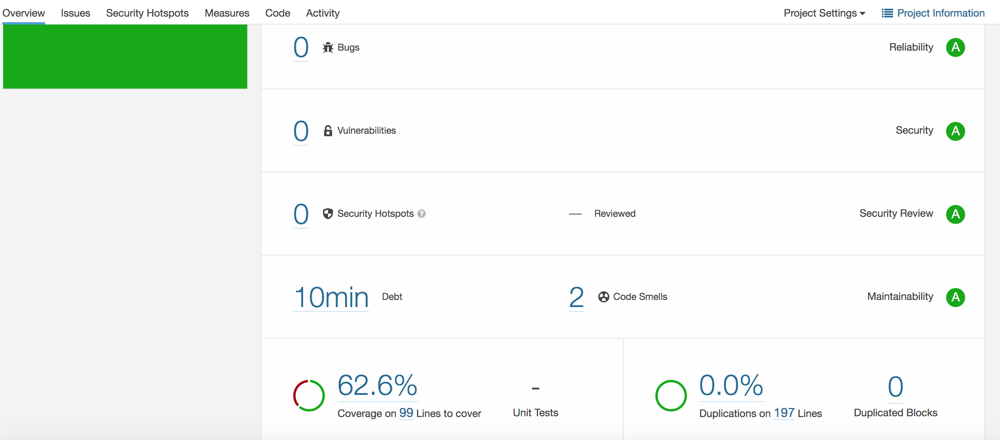
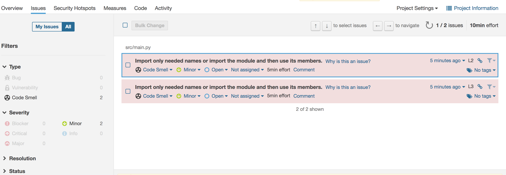

 
# Assignments Repository

In this repository, you'll work on your homework assignments and submit your completed assignments for review by the TAs.

### Please remember:
1. Your Source Code should be located under src folder.
2. Update the checklist document under docs folder
3. Add your datasets under data folder
4. In this ReadMe, append screenshots, documentation, and other requirements

### Screenshot of SonarScanner Result:

Please note that the other files not related to this assignment were removed(e.g. word.count, oop...)therefore I could only generated overall test coverage as below:

### Implemented Functions
1. Map(): This is used to take the sum for both cases and deaths to get their accumulated values
2. Reduce(): This is to apply a chain of sum of all the values within a time range selected by user
3. Lambda(): This is used together with Reduce() to define the sum